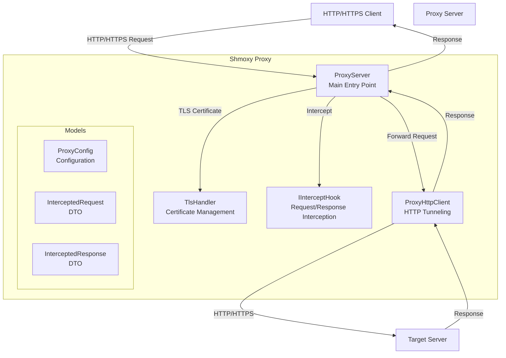
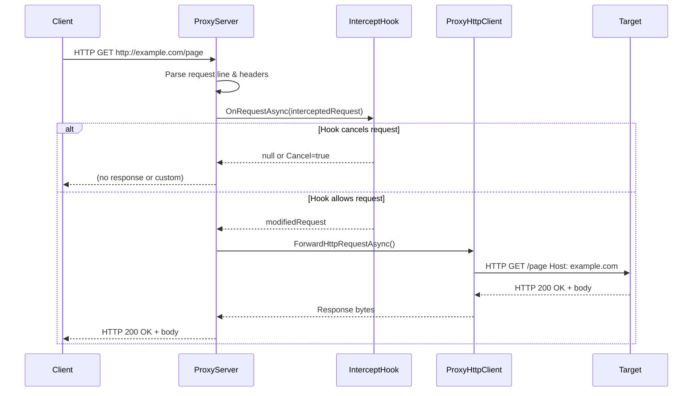
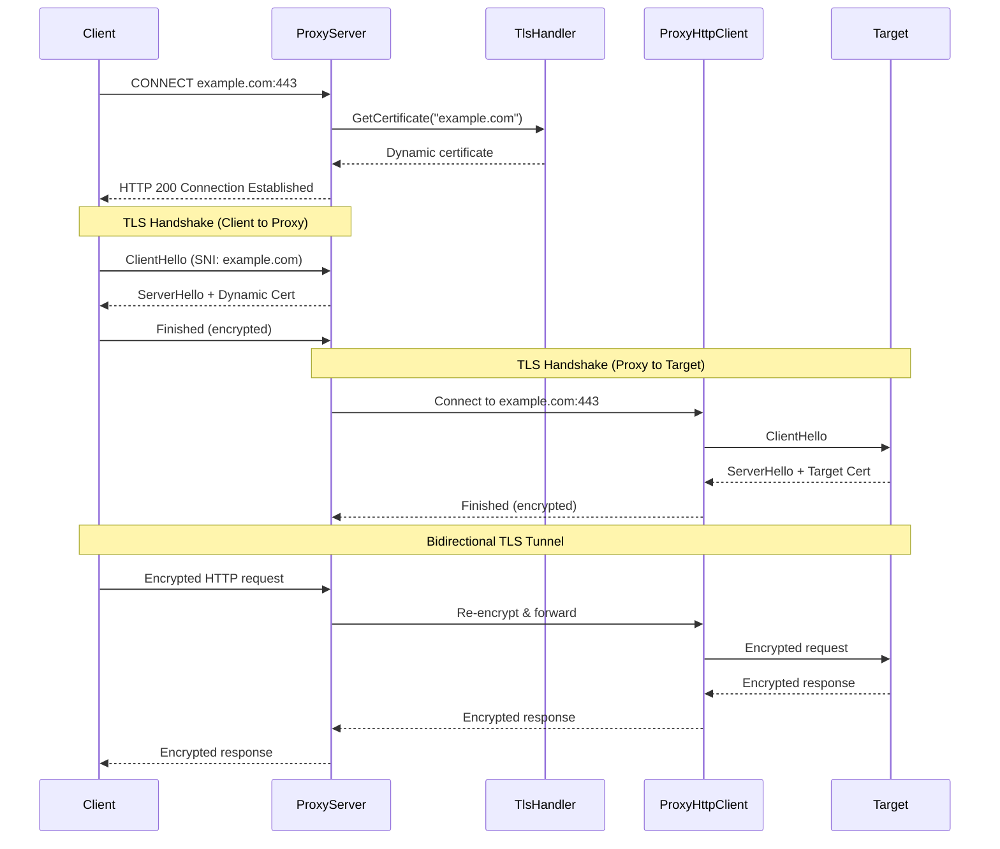
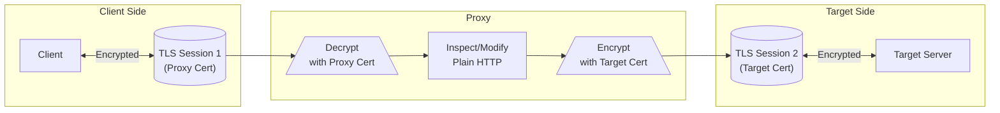
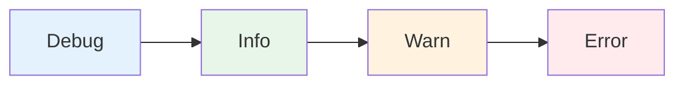

# Shmoxy Proxy Server Architecture

## Overview

Shmoxy is an HTTP/HTTPS proxy server with TLS termination capabilities. It intercepts both HTTP and HTTPS traffic, dynamically generating certificates for HTTPS sites to enable traffic inspection and modification.

## Component Architecture



## Core Components

### ProxyServer

**Location:** `server/ProxyServer.cs`

The main proxy server implementation that:
- Listens for incoming TCP connections
- Distinguishes between HTTP and HTTPS (CONNECT) requests
- Manages TLS termination for HTTPS traffic
- Coordinates request/response interception
- Serves built-in info page and certificate downloads

**Key Responsibilities:**
- Accept client connections on configured port
- Parse HTTP request lines and headers
- Route CONNECT requests to HTTPS tunnel handler
- Route HTTP requests to direct handler
- Apply intercept hooks before forwarding
- Serve proxy status page at `/`

### TlsHandler

**Location:** `server/TlsHandler.cs`

Handles TLS certificate management:
- Generates a self-signed root CA certificate
- Dynamically creates server certificates for any hostname
- Implements SNI (Server Name Indication) support
- Caches generated certificates for performance

**Certificate Generation Flow:**
1. Generate 2048-bit RSA root CA (valid 10 years)
2. For each hostname, generate end-entity certificate
3. Sign end-entity cert with root CA
4. Include SAN (Subject Alternative Name) extension
5. Cache certificate for subsequent requests

### IInterceptHook

**Location:** `server/interfaces/IInterceptHook.cs`

Interface for request/response interception:
- `OnRequestAsync()`: Called before forwarding to target
- `OnResponseAsync()`: Called after receiving from target

**Implementations:**
- `NoOpInterceptHook`: Pass-through implementation
- `InterceptHookChain`: Chain of multiple hooks

### ProxyHttpClient

**Location:** `server/ProxyHttpClient.cs`

HTTP client for tunneling through proxy:
- Establishes CONNECT tunnels for HTTPS
- Sends HTTP requests through established tunnels
- Reads and parses HTTP responses

## Request Flows

### HTTP Request Flow



**Step-by-step:**

1. **Client sends HTTP request** to proxy (e.g., `GET http://example.com/page`)
2. **ProxyServer parses** the request line and headers
3. **InterceptHook** is called with `InterceptedRequest` DTO
4. **Hook can modify** or cancel the request
5. **ProxyHttpClient opens** new TCP connection to target
6. **Request is forwarded** with relative path
7. **Response is relayed** back to client
8. **Connection closes** after response complete

### HTTPS CONNECT Tunnel Flow



**Step-by-step:**

1. **Client sends CONNECT** request to establish tunnel
2. **ProxyServer requests** dynamic certificate from TlsHandler
3. **TlsHandler generates** certificate for `example.com` signed by root CA
4. **ProxyServer responds** with `200 Connection Established`
5. **Client initiates TLS handshake** with proxy (thinking it's the target)
6. **Proxy presents dynamic certificate** - client validates against trusted root CA
7. **Proxy initiates separate TLS handshake** with actual target server
8. **Bidirectional tunnel established** - proxy decrypts from client, re-encrypts to target

### TLS Termination Detail



**Key Points:**

- Proxy terminates client TLS connection using **dynamically generated certificate**
- Proxy inspects/modifies **plain HTTP** in the middle
- Proxy re-encrypts to target using **target's actual certificate**
- Client must **trust proxy's root CA** for this to work
- Target sees connection from **proxy IP**, not client IP

## Configuration

### ProxyConfig

**Location:** `models/configuration/ProxyConfig.cs`

```csharp
public class ProxyConfig
{
    public int Port { get; set; } = 8080;
    public string? CertPath { get; set; }
    public string? KeyPath { get; set; }
    public LogLevelEnum LogLevel { get; set; } = LogLevelEnum.Info;
}
```

**Properties:**
- `Port`: Listening port (0 for OS-assigned)
- `CertPath`: Path to custom TLS certificate (future use)
- `KeyPath`: Path to custom private key (future use)
- `LogLevel`: Debug, Info, Warn, Error

### Logging Levels



**Level Behavior:**
- **Debug**: All messages (connection details, request/response dumps)
- **Info**: Normal operation (server start, request summaries)
- **Warn**: Potential issues (certificate warnings, timeouts)
- **Error**: Errors only (connection failures, exceptions)

## Data Models

### InterceptedRequest

**Location:** `models/dto/InterceptedRequest.cs`

```csharp
public class InterceptedRequest
{
    public string Method { get; set; }
    public Uri? Url { get; set; }
    public string Host { get; set; }
    public int Port { get; set; }
    public string Path { get; set; }
    public Dictionary<string, string> Headers { get; set; }
    public byte[]? Body { get; set; }
    public bool Cancel { get; set; }
}
```

### InterceptedResponse

**Location:** `models/dto/InterceptedResponse.cs`

```csharp
public class InterceptedResponse
{
    public int StatusCode { get; set; }
    public string? ReasonPhrase { get; set; }
    public Dictionary<string, string> Headers { get; set; }
    public byte[] Body { get; set; }
    public bool Cancel { get; set; }
}
```

## Extension Points

### Custom Intercept Hooks

Implement `IInterceptHook` to intercept and modify traffic:

```csharp
public class MyCustomHook : IInterceptHook
{
    public Task<InterceptedRequest?> OnRequestAsync(InterceptedRequest request)
    {
        // Modify request headers, body, or cancel
        request.Headers["X-Custom-Header"] = "value";
        return Task.FromResult<InterceptedRequest?>(request);
    }
    
    public Task<InterceptedResponse?> OnResponseAsync(InterceptedResponse response)
    {
        // Modify response or cancel
        return Task.FromResult<InterceptedResponse?>(response);
    }
}
```

### Hook Chain

Multiple hooks can be chained:

```csharp
var chain = new InterceptHookChain()
    .Add(new LoggingHook())
    .Add(new FilteringHook())
    .Add(new ModificationHook());

var server = new ProxyServer(config, chain);
```

## Security Considerations

### Root CA Trust

For HTTPS interception to work:
1. Download root CA from `http://localhost:<port>/root-ca.pem`
2. Install in system/browser trusted root store
3. Browser will trust dynamically generated certificates

### Certificate Validation

- Proxy accepts **all certificates** from target servers
- This allows interception but bypasses target validation
- Production use should implement proper certificate validation

### Network Isolation

- Proxy binds to localhost by default
- Configure firewall rules for remote access
- Consider authentication for production deployments

## File Structure

```
src/shmoxy/
├── Program.cs                          # CLI entry point
├── server/
│   ├── ProxyServer.cs                  # Main proxy logic
│   ├── ProxyHttpClient.cs              # HTTP tunneling
│   ├── TlsHandler.cs                   # Certificate management
│   ├── interfaces/
│   │   └── IInterceptHook.cs           # Interception interface
│   ├── hooks/
│   │   ├── NoOpInterceptHook.cs        # Pass-through implementation
│   │   └── InterceptHookChain.cs       # Hook chain implementation
│   └── helpers/
│       └── RNGCryptoServiceProvider.cs # Random bytes helper
└── models/
    ├── configuration/
    │   └── ProxyConfig.cs              # Configuration class
    └── dto/
        ├── InterceptedRequest.cs       # Request DTO
        └── InterceptedResponse.cs      # Response DTO
```

## Testing Strategy

### Unit Tests (`shmoxy.tests`)

- **ProxyServerTests**: Server lifecycle, basic request handling
- **TlsHandlerTests**: Certificate generation and caching
- **InterceptHookTests**: Hook chain execution order
- **ProxyHttpClientTests**: HTTP tunneling (placeholder)

### E2E Tests (`shmoxy.e2e`)

- **BasicTest**: Project setup verification
- **HttpsInterceptionTests**: Real browser HTTPS interception
- **ProxyInfoPageTests**: Info page and certificate downloads

## Performance Considerations

### Certificate Caching

- Certificates cached per hostname
- Avoids regeneration overhead for repeat visits
- Cache cleared on `TlsHandler.Dispose()`

### Stream Copying

- Uses 8KB buffer for stream copying
- Bidirectional async copying for tunnels
- Connection: close header simplifies response boundary detection

### Memory Management

- Proper disposal of `TcpClient`, `SslStream`, `X509Certificate2`
- `IDisposable` pattern throughout
- CancellationToken support for graceful shutdown

## Future Enhancements

- [ ] Custom certificate/key file support
- [ ] Request/response body decoding (gzip, brotli)
- [ ] WebSocket support
- [ ] HTTP/2 support
- [ ] Authentication middleware
- [ ] Request/response logging to file
- [ ] Rate limiting
- [ ] Request replay functionality
